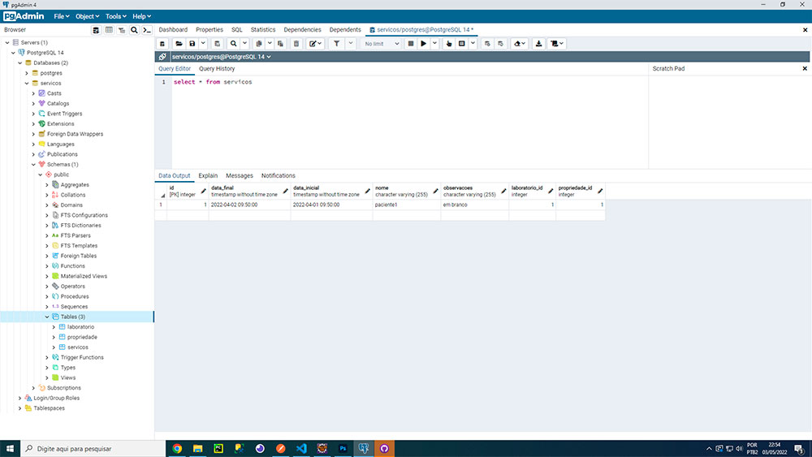
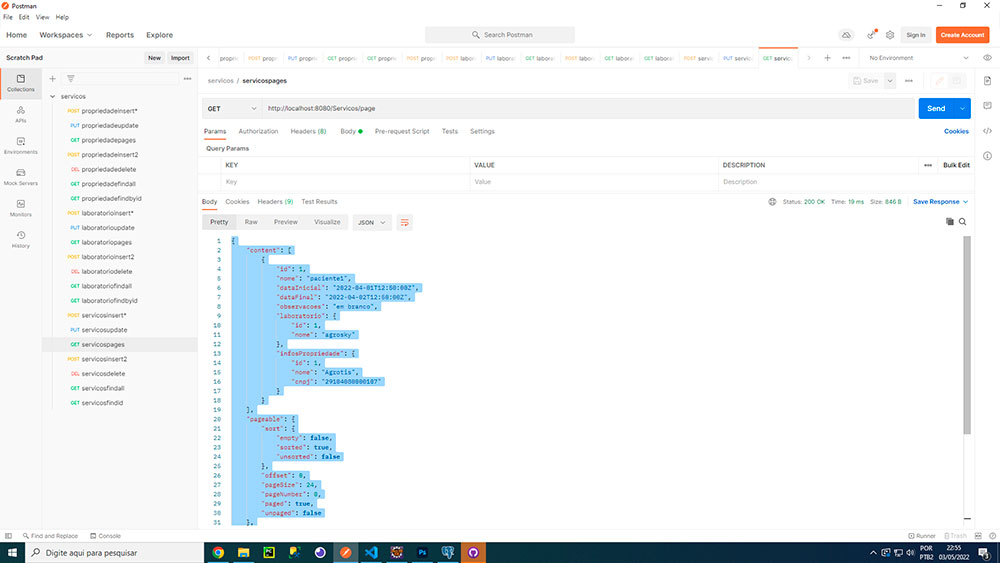
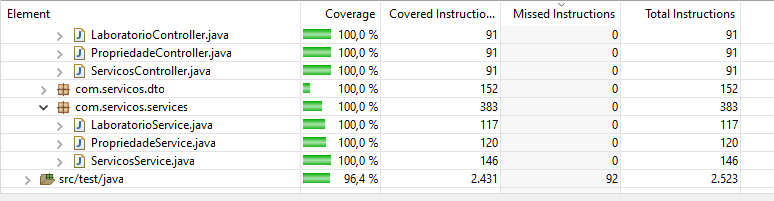

<p align="center">Projeto de uma Rest Api - Um CRUD com Bacon de Dados PostgreSQL</p>

<p align="center">

## Technologias usadas neste projeto
 
  
## Objetivo
Rest API Crud Application With Postgre.

## Banco de Dados 
Crie um banco de nome Servicos e...

```bash
src/main/resources/application-prod.properties
Utilizado postgresql altere login/senha de acordo com o seu servidor

Após criação do banco trocar para update
de spring.jpa.hibernate.ddl-auto=create
para spring.jpa.hibernate.ddl-auto=update
  
```
  
## Dependências
```bash
para instalar lombok
C:\Users\USUARIO\.m2\repository\org\projectlombok\lombok\1.18.24\lombok-1.18.24.jar
Selecionar a pasta onde está o eclipse ou spring tools aperta em install

Reiniciar o eclipse ou spring tools
Depois vai na aba project > clean
ele vai gerar automaticamente os getters and setters

```
  
## Test JUnit 5
```bash
Para teste funcionar é preciso ativar o junit5

na aba Project>Properties> Java Build Path>Libraries

Na lista deve aparecer Junit5, se não estiver preciona add library...
Junit, next , depois escolhe na lista junit5 e finish
```

## Collection
o Json para uso no postman encontra-se na pasta assets/json
  
## Para acesso à URL Swagger
http://localhost:8080/swagger-ui.html
  
## Swagger
swagger.json << Arquivo encontra-se na Raiz
 
  
## Banco de Dados
script.sql encontra-se na pasta assets/banco
 
  
## Arquivo JSON parar usar no Insomnia ou Postman
servicos.postman_collection.json encontra-se em assets/json
 

## Teste
 

## Suporte

geraldo@gpsoft.com.br

## Sobre

[Geraldo P Melo](https://gpsoft.com.br)
